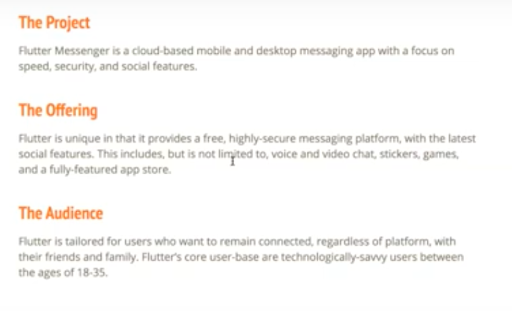

# Lecture IV: Stakeholder Management

a. [Additional Resources](#Additional-Resources)     
b. [Design v Art](#Design-v-Art)     
c. [Business Design](#Business-Design)     
d. [Project Briefs](#Project-Briefs)     
e. [Evaluating a Brief](#Evaluating-a-Brief)     

 

## Additional Resources

[Lecture IV Recording: Ann-Marie Sebastian UXPT3](https://youtu.be/i3-jtG5uL3k)  

[Lecture IV Assignment](https://docs.google.com/document/d/1PpGEqx5kbIViHHn9hK4f_u11_CJGovdbKcuN1Am0EDU/edit?usp=sharing) 

 

[Lambda UX Business & Design (4 min)](https://youtu.be/d_lBPBccbBk)  

[Project Briefs (2 min)](https://youtu.be/FPwv0lDhe6c)  

[Parsing Business Requirements (2 min)](https://youtu.be/dLvL0i7bKPE)  

 

[Design Kit: Methods, by IDEO.org](http://www.designkit.org/methods) provides a list of engaging activities meant to help develop and understand design methods to use when problem solving or testing.

 

## Design v Art

What is the difference between _design_ and _art_?

Designers are focused on fixing problems whereas artists' work is not centered around problem solving, though both provide value and creativity.

Art tends to be more self-focused, whereas design is client focused and has to be very functional. Art often wants to provoke reflections and deeper thought on a topic, but doesn't necessarily provide a solution.

Design is not just creating beautiful things, it must create value as a solution and be testable.

 

Design is often confused with art, but they’re two radically different endeavors. While both pursuits can produce aesthetically pleasing results, design exists to solve a problem while art simply exists. That’s not to say that art has no purpose, it is a pillar of our human culture. But, art does not need to solve a problem while design does.

As designers, our work is inherently intertwined with business because we are professional problem solvers. Businesses exist to provide value in the form of goods or services to customers.

Oftentimes, that value is the solution to a problem the customer is experiencing. So, depending on your perspective, designers are business people and business people are designers.

However, what distinguishes us from our business peers is our systematic approach to solving problems with our UX design toolset.

Businesses provide value in the form of goods or services to customers. UX is part of that value proposition. Given two products, the one with the better UX is more valuable because it is easier for the customer to extract that value.

 

[Your Designers are Not Artists , and You Need to Stop Thinking That Way](https://blog.hubspot.com/marketing/designers-are-not-artists)  

[Art v Design](https://www.toptal.com/designers/creative-direction/art-vs-design0)  

 

## Business Design

Do we need to understand business as designers and why would it be important?

We need to be able to find the alignment between the results the client or stakeholders want, and the design we want to push. It's balancing the needs between the business for staying profitable and the users' needs for experience.

There are business designers, whose focus is understanding product market fit, revenue models, and more of the business decision making. They understand the role that design plays in solving problems but from a strong business perspective.

Businesses exist to provide value to customers through their product/service, so our focus as designers is to bring that, but while balancing the resources of the business, like employees, finances, etc.

 

How do you think business requirements impact our design choices? Things like product monetization, technical or design requirements, etc.

Sometimes business will base decisions on collected industry or revenue data that might conflict with what our user testing shows. It's important to communicate these findings to determine there needs to be a pivot in the goals or design.

There may also be governance or regulations in place -- like in FinTech or health care -- that will adjust how something has to be done or designed. Company vision and timeline/resource constraints have to meet in a compromise for an aligned design, which are placed in project briefs.

 

Business requirements are constraints and objectives defined by business stakeholders for a specific project. They outline the necessary details or considerations that need to be included in the project.

These requirements come from business stakeholders because they directly relate to the organizational capacity and flexibility of the business. Given unlimited time and money, it would be possible to execute and any design or project. However, businesses are resource and time capped - they don’t have all the time and money in the world to build anything. So, business requirements outline the constraints they’re operating within so we don’t exceed them with our ideas.

Business requirements have a tremendous impact on our design choices. We need to make sure we understand them and take them into account when we’re creating our designs. If we fail to do so, then our designs will not be executed because they’re impossible to build.

 

For example, if our business requirements state that we only have the developers who can build a website, but we design a mobile app. Not only would it be impossible to create our design, but we’ve wasted time and money creating a design that wasn’t feasible from the start.

Now as UX designers, we need to recognize that there is a fundamental tension between business requirements and our users’ needs. Maybe after we do some user research, we find that a mobile app would be a better experience and more valuable to the user. At this point, you’d need to have a discussion with your business stakeholders to explain why the requirement doesn’t make sense for your users based on your research.

Sometimes this will persuade them to change the requirement. Since businesses are in the business of solving problems for customers, they want to make sure their products deliver value. So, when presented with compelling evidence that their requirement leads to a sub-optimal value proposition, they should be willing to make the change.

Other times, no matter how compelling the evidence, they won’t be able to change. Remember, they’re dealing with a finite amount of money and time, so they can’t just change everything at the drop of a hat. Now we’ve arrived at that fundamental tension we mentioned earlier: how do we reconcile fixed business requirements with our users’ needs? Figuring out a solution that works for everyone is our job as UX designers

 

[7 Things Every Designer Should Know About Business](https://www.beyondusers.com/7-things-every-designer-should-know-about-business0)  

[What is Business Design?](https://medium.com/spotless-says/what-is-business-design-58d849eaefef)  

[Designers Shouldn't Study Code. They Should Study Businesss](https://medium.com/@joshuantaylor/designers-shouldn-t-code-they-should-study-business-dc3e7e203d39)  

 

[So You Want to Be a Business Designer?](https://medium.com/ideo-stories/so-you-want-to-be-a-business-designer-e424f89cea4b)  

> We like people who connect with others and make work better by identifying linkages and inspiration others might not see, something we call analogous inspiration.

[What is Business Design and How Do I Become a Business Designer?](https://www.beyondusers.com/guides/what-is-business-design-guide)  

 

## Project Briefs

### What is a Project Brief?

Project briefs are an invaluable tool for helping our teams stay organized. We use them to succinctly state what the goals and expectations are for a given project.

They are also like a project "contract" in that they become the agreed upon plan of everyone involved in the initial planning. If the designs or work that stem from those decisions differ, it's a safeguard that allows one to point back to the originally specified direction (or clarify how and when decisions pivoted from it).

 

> It attempts to “clearly summarize the overall plan for the project: what you’re doing, why you’re doing it, relevant constraints that will drive your work, and what outcomes you expect.”   
> - Leah Buley, The User Experience Team of One  

> “Often, when a project is beginning, everyone has distinct ideas for what the right outcome looks like. In team discussions, it’s possible for people to express their point of view and think they’re all saying the same thing, but actually have very different ideas of what they expect… [Having a brief] creates an opportunity for everyone to agree or, if not agree, at least have a productive conversation about the focus and goals of the project [or design].“   
> - Leah Buley, The User Experience Team of One  

 

### Who Creates a Project Brief?

Project briefs can be created by stakeholders and by us. Stakeholders typically provide a project brief at the beginning of a project to outline their vision and initial business requirements.

Designers also create project briefs. They’re powerful tools for ensuring alignment between all of a project’s stakeholders. Any time we need to make sure that everyone on the team is aligned around a shared vision is a great time to write a project brief.

 

### Analyzing a Project Brief

Project briefs typically contain business needs and requirements, user needs, goals, and key expectations. However, these won’t always be spelled out in the brief because there is an infinite number of ways to create a brief. 

So, you’ll need to study it thoroughly to make sure you understand what it is asking of you. If you find something that you’re not sure what to do about, then this is a detail you should bring up in a stakeholder meeting to get clarity around.

 

Make sure to understand what amount of research you need to do and create an action step plan for how you'll tackle answering the questions you have.

It's always important to have alignment at the start of the project to ensure a shared vision is common amongst all team members to avoid deadline disappointment.

Sometimes the company will say what they _think_ the user needs but it's important to do interviews and testing in advance to _ensure_ that the user needs are correct. A third party company may need to conduct the survey to get more honest responses from employees/users afraid of giving their direct opinion.

Asking if you can speak with users or employees of the client is a valid question -- but it depends on the client's budget or timeline, or how they view the value of you doing that research.

 

Another valuable opinion to provide to a client is letting them know that there may not be a need for their solution, or that their solution is very ambitious given their other constraints and proposing a simpler, MVP (minimum viable product) option to pursue.

Briefs can vary in format and specificity by company and project. There are no standard tempaltes. If the company doesn't provide indicators of how detailed they want it to be, it's your skill to ask the right clarifying questions to find out what information is needed or missing. If nobody knows, your recommendation might be to conduct user research.

 

A brief that includes a cost estimate is really a proposal. Most do are focused on the technical requirements and outlines.

A proper proposal would also include a certain number of included revisions to give the customer the ability to go back and forth to reach a great design. You can specify "high fidelity" or "concept sketches" to be more clear about the quality of each revision.

This secures your time and worth with clients and gives you a specific boundary to request additional fees or decline the remainder of the project (if they are impossible to please).

 

As an employee, you'll estimate costs less (because you're salaried) but you will estimate timeline. 

 
 

## Evaluating a Brief

Let's take a look at this outline of a client's needed project. How do we evaluate it?

When the client says, "with a focus on speed, security, and social features," this could tell us their guiding principles or key goals. Our design flow should reduce the number of screens to keep things quick.

The offering tells us the main features the client wants and the average user's demographics.

 

What questions are not yet answered or you're left wondering about after reading this?

They want to create an app with many features (voice, video chat, stickers, games and an app store).

Because of all these features, we need to ask how they want to prioritize these requests based on the core functionality of the app.

> What need is this fulfilling? What problem is this solving?  

 

The client hasn't told us explicitly but we can parse it out and then ask, "Is this what you are looking for?"

Rather than _assuming_, we should verify if our guess matches the client's vision.

 

The UVP (unique value proposition) is that it is a fast, secure and platform independent messaging app.

But the _human need_ that it fulfills is the need to connect to others.

*How* the connection happens -- it's fast, it's secure, etc. -- is the UVP. The actual human need we have to keep at the center of the project is connection.

 

Next we should evaluate what the MVP (minimum viable product) would be for this, assuming there are financial or time constraints.

What has to be in the most basic, first version of this app?

Security is probably a top priority because this brief mentions it multiple times. They appear to be very conscious about privacy and data.

A form of communication needs to be in the MVP -- but it's unclear if their priority is voice, video or text messaging.

Another goal is to be cross-platform, so what would we create first? Android, iOS?

Web applications are the most ubiquitous solution that span device types, so starting with a web app and then transitioning it to more specific platform solutions would be a smart approach.

 

If you feel uncertain about the viability or direction of their requests, that's the time to do research and find out more.

We have to be aware of self-centered designing when making our own assumptions of what is right or will work with the user base. It's best to go test theories and see what the actual research says.

 

> What are the goals of the product?  
> Why is the client building this?  

Usually the client has identified a need and has a goal for funding a project. We need to identify that to understand what the goals are of this product to the company as well.

There has to be added value to draw customers from their existing solution to the new one you're designing.

For example, consider [SuperHuman](https://superhuman.com). They optimize email handling. Their price point is roughly $40 per month. If most users have free email accounts, what value do they provide that makes that price point worthwhile to a particular user base?

The users are the ones driving and informing the design process and business goals, because they are the ones using the product. The earlier we bring users into the loop, the more likely our design will be successful.

 

### Practice

Take a look at [this brief](https://docs.google.com/document/d/1WuOjbm_zqjWnt_pRGOlK1pAInt60H5I6Vb6SOMjAOnI/edit) and answer the following:

 

> What are the initial business needs?  
> What user needs is this fulfilling  
> What requirements should the MVP have?  
> What clarifying questions need answered?  

 

